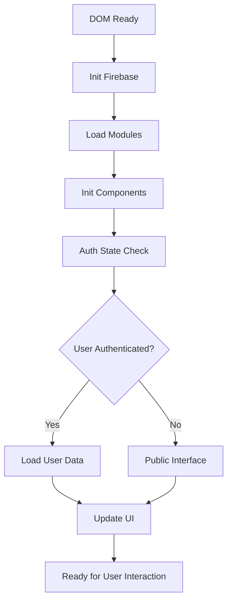

# 🏛️ Guide d'Architecture - FORNAP Platform

## 📐 Architecture Générale

La plateforme FORNAP suit une **architecture modulaire** avec séparation claire des responsabilités et réutilisabilité maximale du code.

---

## 🏗️ Diagramme d'Architecture

```
┌─────────────────── FRONTEND ───────────────────┐
│                                                │
│  ┌─── PAGES ────┐    ┌──── MODULES ────┐       │
│  │ index.html   │    │ config.js       │       │
│  │ membership   │◄───┤ auth-service.js │       │
│  │ payment      │    │ utils.js        │       │
│  │ profile-setup│    │ components.js   │       │
│  │ congratulat. │    └─────────────────┘       │
│  └──────────────┘                              │
│                                                │
│  ┌──── STYLES ───┐    ┌───── ASSETS ────┐      │
│  │ main.css      │    │ images/         │      │
│  │ components.css│    │ fonts/          │      │
│  └───────────────┘    └─────────────────┘      │
│                                                │
└────────────────────────────────────────────────┘
                         │
                         ▼
┌─────────────────── BACKEND ────────────────────┐
│                                                │
│  ┌────── FIREBASE ──────┐                      │
│  │ Authentication        │                      │
│  │ Firestore Database   │                      │
│  │ Hosting (optionnel)  │                      │
│  └──────────────────────┘                      │
│                                                │
└────────────────────────────────────────────────┘
```

---

## 📁 Structure Détaillée

### 🎯 Modules JavaScript

```
assets/js/
├── config.js               # 🔧 Configuration centralisée
│   ├── firebaseConfig      # Configuration Firebase
│   ├── MEMBERSHIP_PLANS    # Définition des forfaits
│   ├── ERROR_MESSAGES      # Messages d'erreur traduits
│   └── APP_CONFIG          # Configuration application
│
├── auth-service.js         # 🔐 Service d'authentification
│   ├── FornapAuthService   # Classe principale
│   ├── init()              # Initialisation Firebase
│   ├── signUp()            # Inscription utilisateur
│   ├── signIn()            # Connexion utilisateur
│   ├── signOut()           # Déconnexion
│   ├── onAuthStateChanged  # Écoute changements état
│   └── getUserData()       # Récupération données utilisateur
│
├── utils.js                # 🛠️ Utilitaires communs
│   ├── FornapUtils         # Classe utilitaires
│   ├── showMessage()       # Système de messages
│   ├── showLoading()       # Modal de chargement
│   ├── validateEmail()     # Validation email
│   ├── validatePassword()  # Validation mot de passe
│   ├── handleError()       # Gestion d'erreurs
│   └── sessionStorage     # Helpers session storage
│
├── components.js           # 🧩 Composants réutilisables
│   ├── FornapComponents    # Classe composants
│   ├── generateNavbar()    # Génération navbar
│   ├── generateFooter()    # Génération footer
│   ├── updateAuthState()   # Mise à jour état auth
│   └── initNavbarEvents()  # Initialisation événements
│
└── app.js                  # 📱 Application principale (LEGACY)
    └── À MIGRER vers les nouveaux modules
```

### 🎨 Styles CSS

```
assets/css/
├── main.css                # 🎨 Styles principaux (existant)
│   ├── Variables CSS       # Couleurs, espacements, fonts
│   ├── Layout global       # Container, grilles, flexbox
│   ├── Composants UI       # Boutons, formulaires, cards
│   └── Pages spécifiques   # Styles par page
│
└── components.css          # 🆕 Composants communs
    ├── Variables globales  # Système de design unifié
    ├── Messages système    # Toast notifications
    ├── Modales             # Loading, confirmations
    ├── Formulaires         # Form components réutilisables
    ├── Boutons             # Système de boutons complet
    ├── Utilitaires         # Classes helper
    └── Animations          # Keyframes et transitions
```

---

## 🔄 Flow de Données

### 📈 Cycle de Vie d'une Page



### 🔐 Flow d'Authentification

```mermaid
graph TD
    A[User Action] --> B{Action Type?}
    B -->|Sign Up| C[FornapAuth.signUp()]
    B -->|Sign In| D[FornapAuth.signIn()]
    C --> E[Create Firebase User]
    D --> F[Authenticate Firebase]
    E --> G[Create Firestore Document]
    F --> H[Load User Data]
    G --> H
    H --> I[Update Auth State]
    I --> J[Notify Components]
    J --> K[Update UI]
```

### 💾 Gestion des Données de Session

```javascript
// Workflow des données de session
membership.html → selectedPlan (sessionStorage)
payment.html    → membershipData + paymentData (sessionStorage)
profile-setup   → Verification + profileData (sessionStorage)
                → Save to Firestore
                → Clear temporary data
```

---

## 🧩 Patterns de Design

### 🏭 Factory Pattern - Composants

```javascript
// components.js
class FornapComponents {
    static generateNavbar(activePage, basePath) {
        return `<nav>...</nav>`; // Factory method
    }
    
    static generateFooter(basePath) {
        return `<footer>...</footer>`; // Factory method
    }
}
```

### 🔄 Observer Pattern - Authentication

```javascript
// auth-service.js
class FornapAuthService {
    constructor() {
        this.authCallbacks = []; // Observers
    }
    
    onAuthStateChanged(callback) {
        this.authCallbacks.push(callback); // Subscribe
    }
    
    notifyAuthStateChange(user) {
        this.authCallbacks.forEach(callback => callback(user)); // Notify
    }
}
```

### 🏪 Singleton Pattern - Services

```javascript
// Chaque service est un singleton global
const fornapAuth = new FornapAuthService(); // Instance unique
window.FornapAuth = fornapAuth; // Export global
```

### 📦 Module Pattern - Configuration

```javascript
// config.js
const FornapConfig = {
    firebase: { /* configuration */ },
    membershipPlans: { /* plans */ },
    // Encapsulation des données de configuration
};
window.FornapConfig = FornapConfig; // Export contrôlé
```

---

## 🔧 Injection de Dépendances

### 📄 Template de Page Standard

```html
<!-- Ordre d'import crucial -->
<script src="../assets/js/config.js"></script>        <!-- 1. Configuration -->
<script src="../assets/js/utils.js"></script>         <!-- 2. Utilitaires -->
<script src="../assets/js/auth-service.js"></script>  <!-- 3. Services -->
<script src="../assets/js/components.js"></script>    <!-- 4. Composants -->
```

### 🔄 Initialisation Séquentielle

```javascript
document.addEventListener('DOMContentLoaded', async function() {
    // 1. Configuration disponible (config.js déjà chargé)
    // 2. Utilitaires disponibles (utils.js déjà chargé)
    // 3. Initialiser les services
    await FornapAuth.init();
    // 4. Initialiser les composants
    initComponents();
    // 5. Logique spécifique à la page
    pageSpecificLogic();
});
```

---

## 🛡️ Gestion d'Erreurs

### 📊 Hiérarchie des Erreurs

```
Application Level
├── Firebase Errors          → auth-service.js
├── Validation Errors        → utils.js
├── Network Errors          → utils.js
├── User Interface Errors   → components.js
└── Business Logic Errors   → Page-specific
```

### 🎯 Strategy Pattern - Error Handling

```javascript
// utils.js
class FornapUtils {
    handleError(error, context) {
        // Strategy based on error type
        if (error.code) {
            // Firebase error
            this.showMessage(FornapConfig.errorMessages[error.code], 'error');
        } else if (typeof error === 'string') {
            // User-defined error
            this.showMessage(error, 'error');
        } else {
            // Generic error
            this.showMessage('Une erreur est survenue', 'error');
        }
    }
}
```

---

## 🔒 Sécurité et Validation

### 🛡️ Couches de Sécurité

```
Frontend Validation (Client-side)
├── utils.js → validateEmail(), validatePassword()
├── Form validation → HTML5 + JavaScript
└── Input sanitization → Before sending to Firebase

Firebase Security (Server-side)
├── Authentication Rules → Firebase Auth
├── Firestore Rules → Database access control
└── API Key restrictions → Firebase Console
```

### ✅ Validation Pipeline

```javascript
// Exemple de validation en cascade
async function processSignUp(email, password) {
    // 1. Validation côté client
    if (!FornapUtils.validateEmail(email)) {
        throw new Error('Email invalide');
    }
    
    // 2. Validation Firebase (côté serveur)
    const user = await FornapAuth.signUp(email, password);
    
    // 3. Validation business logic
    if (user && !userData.consent) {
        throw new Error('Consentement requis');
    }
}
```

---

## 🚀 Performance et Optimisation

### ⚡ Stratégies d'Optimisation

#### 1. **Lazy Loading des Modules**
```javascript
// Chargement conditionnel
if (needsPaymentFeatures) {
    await import('./payment-module.js');
}
```

#### 2. **Cache des Composants**
```javascript
// components.js - Cache HTML généré
class FornapComponents {
    static navbarCache = new Map();
    
    static generateNavbar(activePage, basePath) {
        const cacheKey = `${activePage}-${basePath}`;
        if (this.navbarCache.has(cacheKey)) {
            return this.navbarCache.get(cacheKey);
        }
        // Générer et cacher
        const html = this.buildNavbar(activePage, basePath);
        this.navbarCache.set(cacheKey, html);
        return html;
    }
}
```

#### 3. **Session Storage Optimisé**
```javascript
// utils.js - Compression des données
setSessionData(key, data) {
    try {
        const compressed = JSON.stringify(data);
        sessionStorage.setItem(key, compressed);
    } catch (error) {
        // Fallback ou nettoyage si quota dépassé
        this.clearOldSessionData();
        sessionStorage.setItem(key, JSON.stringify(data));
    }
}
```

---

## 📱 Responsive Design Architecture

### 🎨 Mobile-First CSS

```css
/* components.css - Architecture responsive */
:root {
    /* Base (mobile) */
    --container-padding: 1rem;
    --font-size-base: 1rem;
}

@media (min-width: 768px) {
    /* Tablet */
    :root {
        --container-padding: 2rem;
        --font-size-base: 1.1rem;
    }
}

@media (min-width: 1024px) {
    /* Desktop */
    :root {
        --container-padding: 3rem;
        --font-size-base: 1.2rem;
    }
}
```

### 📐 Breakpoints Système

```javascript
// utils.js - Detection responsive
class FornapUtils {
    getBreakpoint() {
        const width = window.innerWidth;
        if (width < 768) return 'mobile';
        if (width < 1024) return 'tablet';
        return 'desktop';
    }
    
    isMobile() {
        return this.getBreakpoint() === 'mobile';
    }
}
```

---

## 🔄 État et Lifecycle

### 🎯 Application State Management

```javascript
// État global de l'application
const AppState = {
    user: null,              // Utilisateur connecté
    selectedPlan: null,      // Forfait sélectionné
    currentStep: 'home',     // Étape du flow
    loading: false,          // État de chargement
    errors: []               // Erreurs actives
};

// Gestionnaire d'état
class StateManager {
    static setState(key, value) {
        AppState[key] = value;
        this.notifyStateChange(key, value);
    }
    
    static getState(key) {
        return AppState[key];
    }
}
```

---

## 🧪 Architecture de Test

### 🔍 Stratégie de Test

```
Tests d'Intégration
├── Page Loading Tests      → Chaque page se charge correctement
├── Module Integration     → Modules communiquent correctement  
├── Firebase Connection    → Auth et Firestore fonctionnent
└── User Flow Tests        → Flow complet membership → congratulations

Tests Unitaires
├── Utils Functions        → Validation, formatage, etc.
├── Auth Service          → Méthodes d'authentification
├── Components Generation → HTML généré correctement
└── Error Handling        → Gestion d'erreurs robuste
```

---

## 🎯 Extensibilité Future

### 🚀 Points d'Extension Prévus

#### 1. **Nouveaux Modules**
```javascript
// Structure pour futurs modules
assets/js/
├── notification-service.js  // Système de notifications
├── payment-service.js       // Gestion paiements réels
├── reservation-service.js   // Réservation d'espaces
└── analytics-service.js     // Tracking et analytics
```

#### 2. **Nouveaux Composants**
```javascript
// components.js - Extension prévue
class FornapComponents {
    static generateModal(type, content) { /* ... */ }
    static generateCard(data) { /* ... */ }
    static generateForm(fields) { /* ... */ }
    static generateTable(data) { /* ... */ }
}
```

#### 3. **API Integration**
```javascript
// Structure pour API backend
class ApiService {
    static baseURL = 'https://api.fornap.fr';
    
    static async get(endpoint) { /* ... */ }
    static async post(endpoint, data) { /* ... */ }
    static async put(endpoint, data) { /* ... */ }
    static async delete(endpoint) { /* ... */ }
}
```

---

## 📋 Conclusion Architecturale

### ✅ Points Forts de l'Architecture

1. **Modularité** - Chaque module a une responsabilité claire
2. **Réutilisabilité** - Composants et utilitaires partagés
3. **Maintenabilité** - Code organisé et documenté
4. **Extensibilité** - Structure prête pour de nouvelles fonctionnalités
5. **Performance** - Chargement optimisé et cache intelligent
6. **Sécurité** - Validation multi-niveaux et gestion d'erreurs robuste

### 🎯 Cette architecture permet à l'équipe de développer rapidement et efficacement de nouvelles fonctionnalités tout en maintenant la qualité et la cohérence du code. 