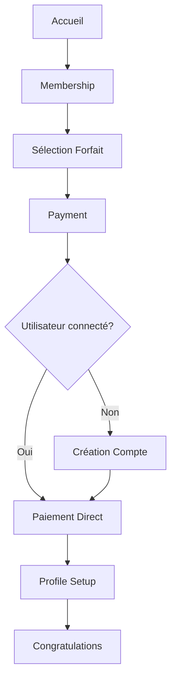

# 🎯 Guide d'Utilisation - FORNAP Plateforme Réorganisée

## 📋 Résumé des Corrections Apportées

### ✅ Problèmes Résolus

#### 1. **Flow d'Authentification Corrigé**
- ❌ **Avant** : Redirection directe `membership.html` → `profile-setup.html` → "Session expirée"
- ✅ **Maintenant** : Flow logique `membership.html` → `payment.html` → `profile-setup.html` → `congratulations.html`

#### 2. **Code Réorganisé et Modulaire**
- ❌ **Avant** : HTML, CSS et JS mélangés dans chaque fichier
- ✅ **Maintenant** : Modules séparés et réutilisables

#### 3. **Design Amélioré**
- ❌ **Avant** : `profile-setup.html` ressemblait à une page de paiement
- ✅ **Maintenant** : Belle page de découverte utilisateur avec animations

---

## 🏗️ Nouvelle Architecture

### 📁 Structure des Modules

```
fornap-platform/
├── assets/
│   ├── css/
│   │   ├── main.css            # Styles principaux existants
│   │   └── components.css      # 🆕 Styles des composants communs
│   └── js/
│       ├── components.js       # Composants navbar/footer (amélioré)
│       ├── config.js          # 🆕 Configuration centralisée
│       ├── auth-service.js    # 🆕 Service d'authentification
│       └── utils.js           # 🆕 Utilitaires communs
├── membership.html            # ✅ Corrigé : sélection sans redirection
├── payment.html              # ✅ Corrigé : flow auth → paiement → setup
├── profile-setup.html        # ✅ Redesigné : belle page de découverte
└── page-template.html         # 🆕 Template d'exemple
```

---

## 🚀 Nouveau Flow Utilisateur

### 📈 Processus d'Abonnement Complet



### 👥 Gestion des Utilisateurs

1. **Nouvel utilisateur** :
   - Sélectionne forfait → Payment → Création compte → Paiement → Profile setup → Congratulations

2. **Utilisateur existant** :
   - Sélectionne forfait → Payment → Connexion → Paiement → Profile setup → Congratulations

3. **Utilisateur déjà connecté** :
   - Sélectionne forfait → Payment → Paiement direct → Profile setup → Congratulations

---

## 🛠️ Utilisation des Nouveaux Modules

### 1. Configuration Centralisée (`config.js`)

```javascript
// Automatiquement disponible via window.FornapConfig
const plans = window.FornapConfig.membershipPlans;
const firebaseConfig = window.FornapConfig.firebase;
```

### 2. Service d'Authentification (`auth-service.js`)

```javascript
// Initialiser le service
await FornapAuth.init();

// Écouter les changements d'état
FornapAuth.onAuthStateChanged((user) => {
    console.log('Utilisateur:', user);
});

// Inscription
const user = await FornapAuth.signUp('email@test.com', 'password', {
    firstName: 'Jean',
    lastName: 'Dupont'
});

// Connexion
const user = await FornapAuth.signIn('email@test.com', 'password');

// Déconnexion
await FornapAuth.signOut();
```

### 3. Utilitaires (`utils.js`)

```javascript
// Messages
FornapUtils.showMessage('Succès !', 'success');
FornapUtils.showMessage('Erreur !', 'error');

// Modal de chargement
FornapUtils.showLoading(true, 'Chargement...', 'Veuillez patienter');
FornapUtils.showLoading(false);

// Validation
const isValidEmail = FornapUtils.validateEmail('test@email.com');
const isValidPassword = FornapUtils.validatePassword('motdepasse');

// Gestion des erreurs
FornapUtils.handleError(error, 'contexte');

// Session storage sécurisé
FornapUtils.setSessionData('key', data);
const data = FornapUtils.getSessionData('key');
```

### 4. Composants (`components.js`)

```javascript
// Générer navbar
const navbarHTML = FornapComponents.generateNavbar('page-active', '');

// Générer footer
const footerHTML = FornapComponents.generateFooter('');

// Mettre à jour l'état d'authentification
FornapComponents.updateAuthState(true); // connecté
FornapComponents.updateAuthState(false); // déconnecté
```

---

## 📄 Template de Page

Utilisez `page-template.html` comme base pour créer de nouvelles pages :

```html
<!DOCTYPE html>
<html lang="fr">
<head>
    <meta charset="UTF-8">
    <meta name="viewport" content="width=device-width, initial-scale=1.0">
    <title>Ma Page - FORNAP</title>
    
    <!-- CSS -->
    <link rel="stylesheet" href="assets/css/main.css">
    <link rel="stylesheet" href="assets/css/components.css">
</head>
<body>
    <!-- Navbar -->
    <div id="navbar-placeholder"></div>

    <!-- Contenu -->
    <main class="main-content">
        <!-- Votre contenu ici -->
    </main>

    <!-- Footer -->
    <div id="footer-placeholder"></div>

    <!-- Scripts Firebase -->
    <script src="https://www.gstatic.com/firebasejs/12.0.0/firebase-app-compat.js"></script>
    <script src="https://www.gstatic.com/firebasejs/12.0.0/firebase-auth-compat.js"></script>
    <script src="https://www.gstatic.com/firebasejs/12.0.0/firebase-firestore-compat.js"></script>
    
    <!-- Modules FORNAP -->
    <script src="../assets/js/config.js"></script>
<script src="../assets/js/utils.js"></script>
<script src="../assets/js/auth-service.js"></script>
<script src="../assets/js/components.js"></script>

    <script>
        document.addEventListener('DOMContentLoaded', async function() {
            // Initialiser les services
            await FornapAuth.init();
            
            // Initialiser les composants
            initComponents();
            
            // Votre code ici...
        });

        function initComponents() {
            // Injecter navbar
            const navbarPlaceholder = document.getElementById('navbar-placeholder');
            if (navbarPlaceholder) {
                navbarPlaceholder.outerHTML = FornapComponents.generateNavbar('ma-page', '');
            }

            // Injecter footer
            const footerPlaceholder = document.getElementById('footer-placeholder');
            if (footerPlaceholder) {
                footerPlaceholder.outerHTML = FornapComponents.generateFooter('');
            }

            // Initialiser les événements
            setTimeout(() => {
                FornapComponents.initNavbarEvents('', {
                    onLogin: () => console.log('Login'),
                    onLogout: () => FornapAuth.signOut()
                });
            }, 100);
        }
    </script>
</body>
</html>
```

---

## 🎨 Styles Disponibles

### Classes Utilitaires

```css
/* Boutons */
.btn                  /* Bouton de base */
.btn-primary         /* Bouton principal */
.btn-secondary       /* Bouton secondaire */
.btn-success         /* Bouton de succès */
.btn-outline         /* Bouton en bordure */
.btn-large           /* Bouton large */
.btn-full            /* Bouton pleine largeur */

/* Layout */
.container           /* Conteneur centré max-width: 1200px */
.flex                /* Display flex */
.flex-col            /* Flex direction column */
.items-center        /* Align items center */
.justify-center      /* Justify content center */
.justify-between     /* Justify content space-between */
.text-center         /* Texte centré */

/* Espacement */
.mb-4, .mt-4, .p-4   /* Marges et padding */
.gap-4               /* Gap flex */

/* Formulaires */
.form-container      /* Conteneur de formulaire */
.form-row            /* Ligne de formulaire (2 colonnes) */
.form-group          /* Groupe de champ */
.form-input          /* Champ de saisie */
.form-select         /* Select */
.form-textarea       /* Zone de texte */

/* Utilitaires */
.hidden              /* Masquer élément */
```

---

## 🐛 Debugging

### Logs de Debug

Tous les modules loggent leurs actions dans la console :

```javascript
// Dans la console du navigateur
console.log('🚀 FORNAP Application démarrée');
console.log('✅ Configuration FORNAP chargée');
console.log('✅ Service d\'authentification FORNAP initialisé');
console.log('✅ Utilitaires FORNAP chargés');
console.log('✅ Navbar FORNAP initialisée');
```

### Variables Globales Disponibles

```javascript
// Dans la console
window.FornapConfig    // Configuration
window.FornapAuth      // Service d'authentification
window.FornapUtils     // Utilitaires
window.FornapComponents // Composants
```

---

## 🔧 Migration des Pages Existantes

Pour migrer une page existante vers le nouveau système :

1. **Ajouter les nouveaux CSS** :
   ```html
   <link rel="stylesheet" href="assets/css/components.css">
   ```

2. **Ajouter les nouveaux modules JS** :
   ```html
       <script src="../assets/js/config.js"></script>
    <script src="../assets/js/utils.js"></script>
    <script src="../assets/js/auth-service.js"></script>
   ```

3. **Remplacer les fonctions** :
   - `showMessage()` → `FornapUtils.showMessage()`
   - Configuration Firebase → `FornapConfig.firebase`
   - Authentification → `FornapAuth`

4. **Utiliser les composants** :
   - Navbar/Footer → `FornapComponents`

---

## 🎉 Résultat Final

✅ **Flow utilisateur logique et intuitif**  
✅ **Code modulaire et maintenable**  
✅ **Design cohérent avec animations**  
✅ **Gestion d'erreurs unifiée**  
✅ **Facilité d'extension et de maintenance**

Le système est maintenant robuste, bien organisé et prêt pour le développement futur ! 🚀 